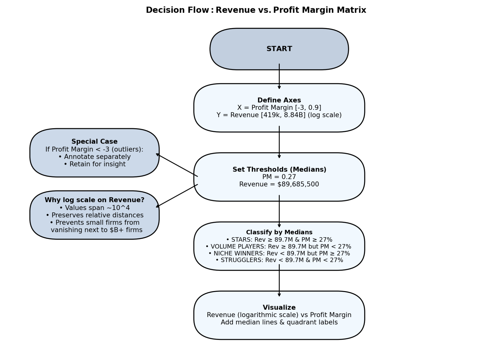
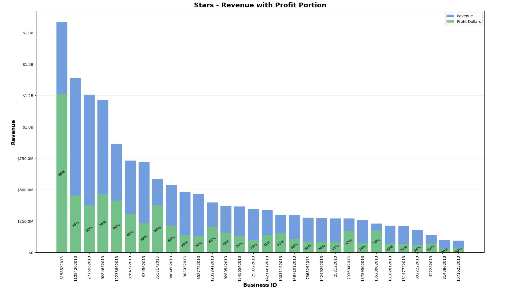

**Business Performance Analysis**

This project analyzes business financial health by examining debt ratios and profitability metrics. The goal is to identify high-risk companies, clean and structure raw data for analysis, and generate insights at both the company and state level.

**Key Steps**

Imported and validated raw business financial data.

Cleaned and normalized data (handling missing values, duplicates, and anomalies).

Calculated Debt-to-Income (DTI) and Debt-to-Equity (D/E) ratios.

Flagged businesses with negative equity (negative D/E) as high-risk.

Aggregated results to generate state-level descriptive statistics.

Visualized relationships between profitability and leverage.

**Decision Flowchart**

The following flowchart illustrates the classification logic used in the Revenue vs. Profit Margin Matrix. It defines thresholds, handles outliers, and shows how businesses are categorized into Stars, Volume Players, Niche Winners, and Strugglers.

The flowchart is generated by the Python script Decision_Flowchart.py, included in the repository.

The analysis includes a decision flowchart that illustrates how businesses are classified into quadrants (Stars, Volume Players, Niche Winners, Strugglers) based on Revenue and Profit Margin.

**Outputs**

`negative_debt_to_equity_businesses.csv` → list of high-risk businesses with negative equity.

`business_level_with_DTI.csv` → cleaned dataset with DTI calculated for each business.

`state_descriptive_stats.csv` → aggregated financial health indicators at the state level.

**Visualizations**

***Revenue vs. Profit Margin — Quadrant Matrix***
Companies are classified into four groups (STARS, VOLUME PLAYERS, NICHE WINNERS, STRUGGLERS) based on revenue and profit margin medians.  
   
   
***Stars — Revenue with Profit Portion***
   Highlights top "STAR" companies, showing revenue bars with profit dollars overlaid, including profit margin labels.  
   
   
**Code Versions**

Business_Health_Analysis.py — initial version.

Business_Health_Analysis_V2.py — adds a division-by-zero safeguard for DTI and refactors code for clarity/readability.

**Tools & Skills Demonstrated**

Python (pandas, matplotlib) for data cleaning, transformation, and visualization.

Jupyter Notebook for reproducible analysis.

Financial analysis concepts (leverage ratios, profitability metrics).

Data storytelling — combining ratios and risk flags to interpret business health.

Developed using Python (pandas) in Jupyter Notebook This project is presented as part of my professional portfolio and is not a distributed solution.
