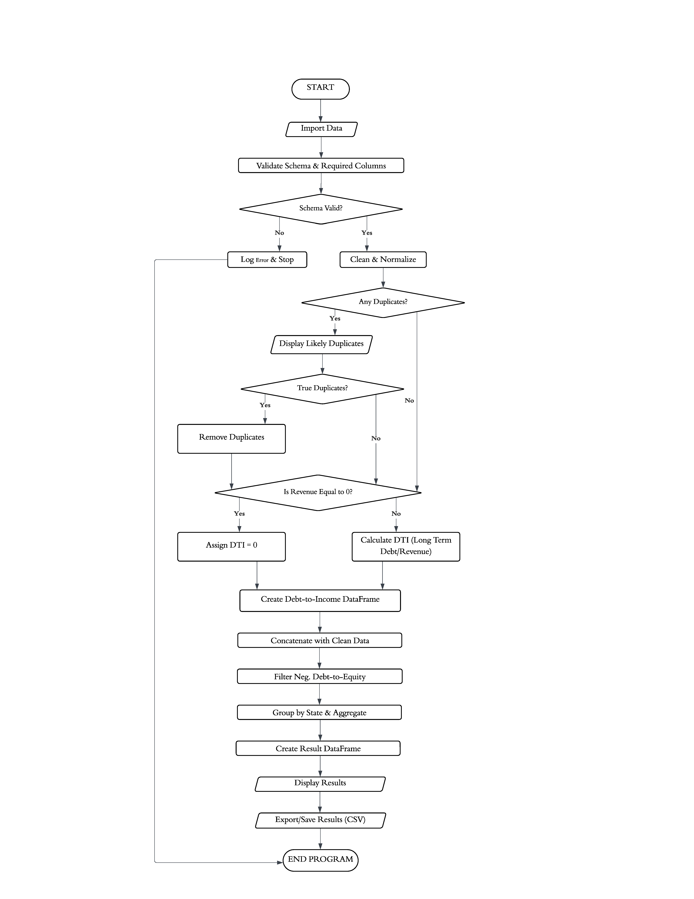
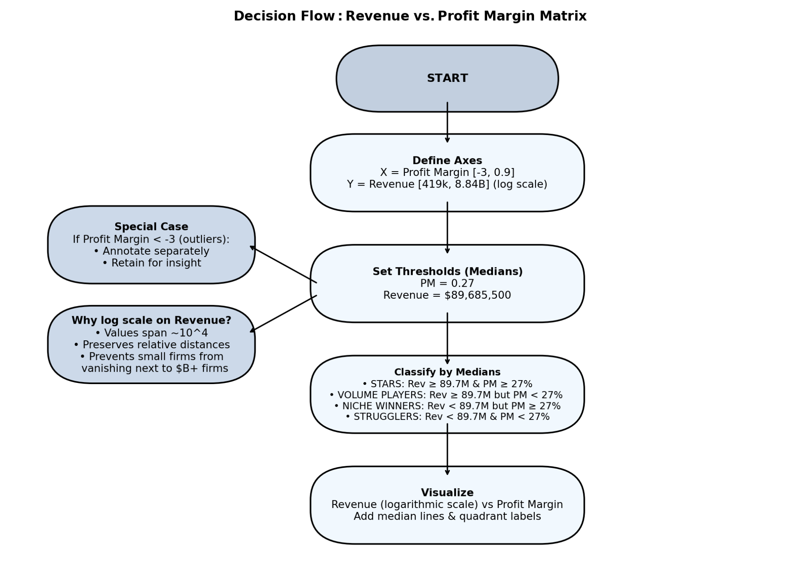
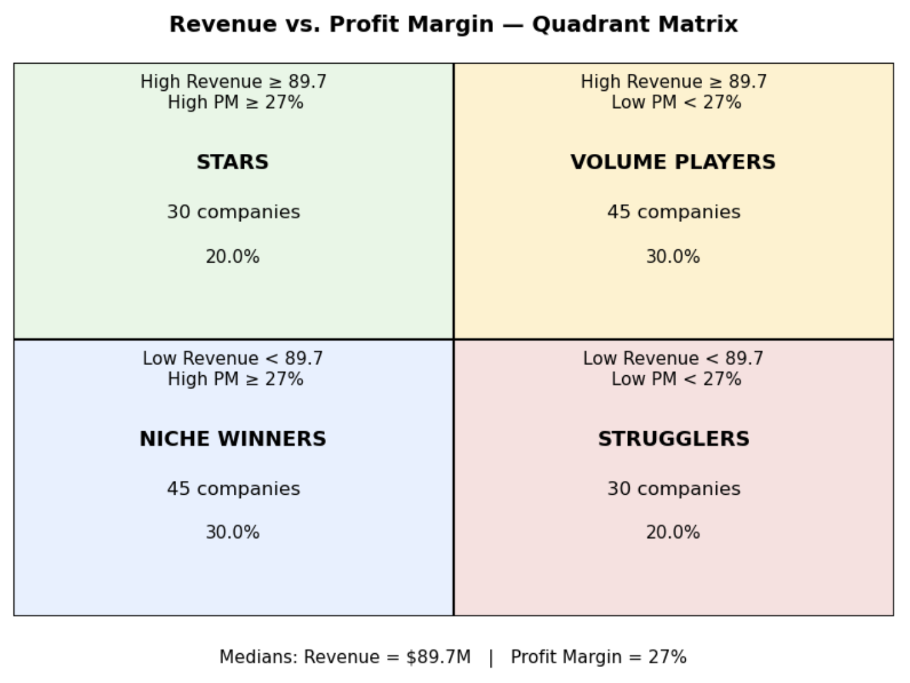
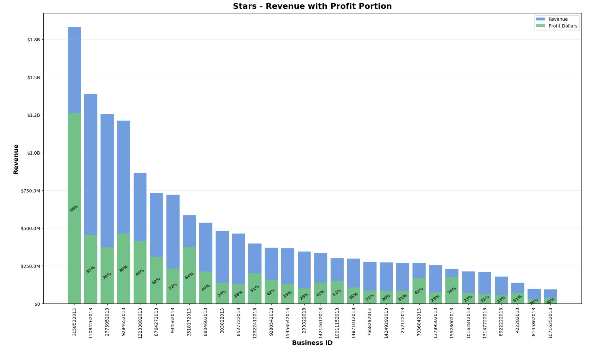
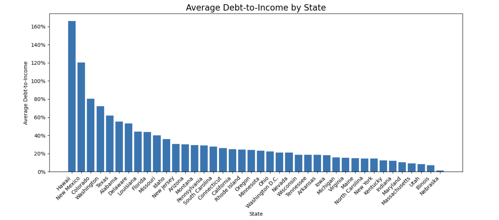
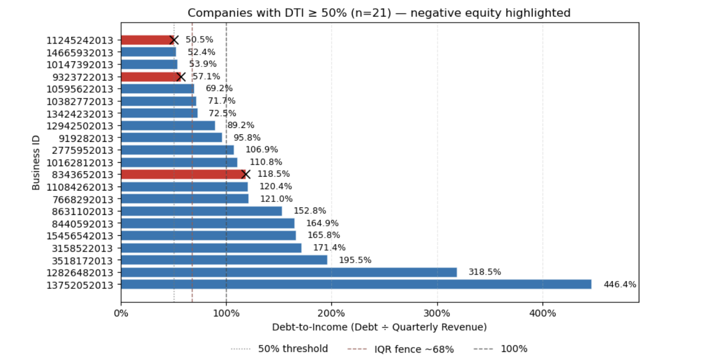
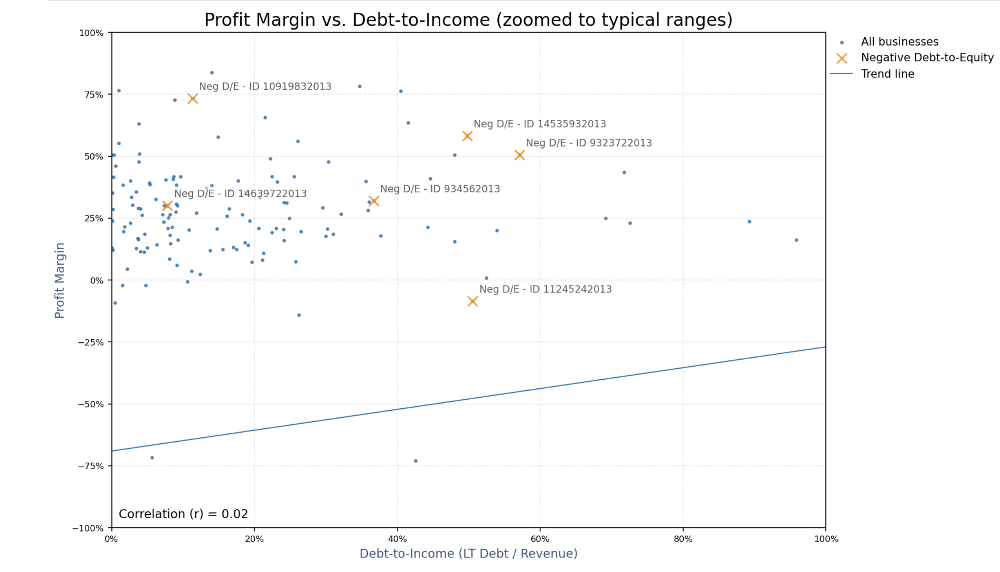
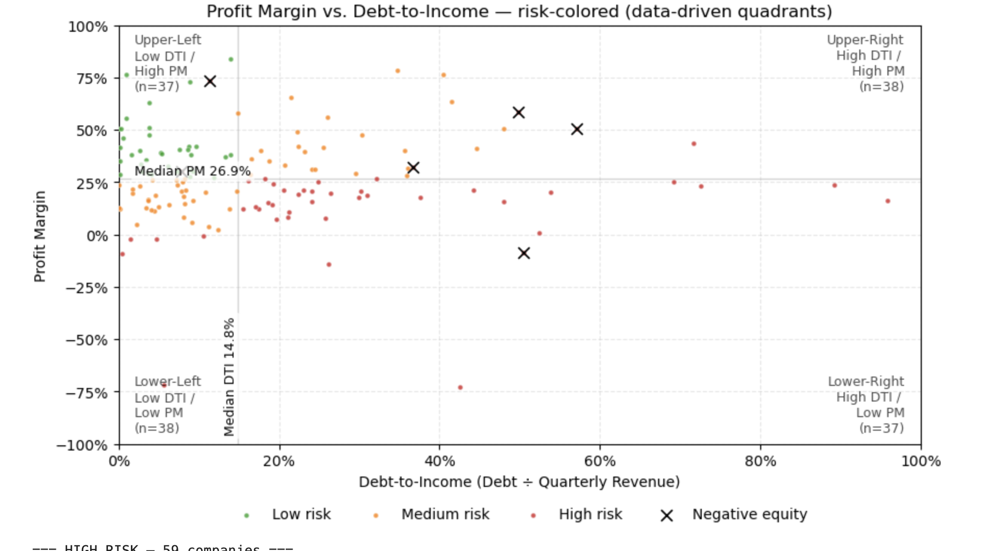
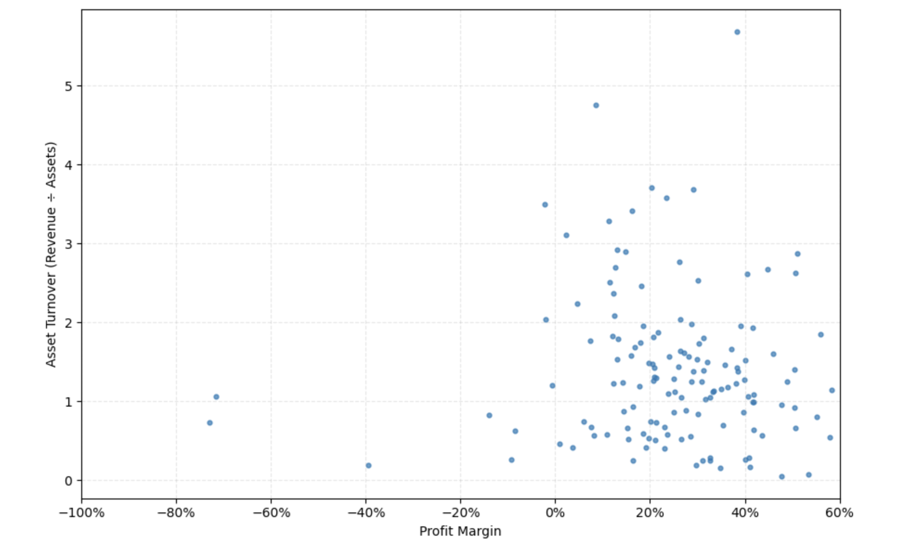
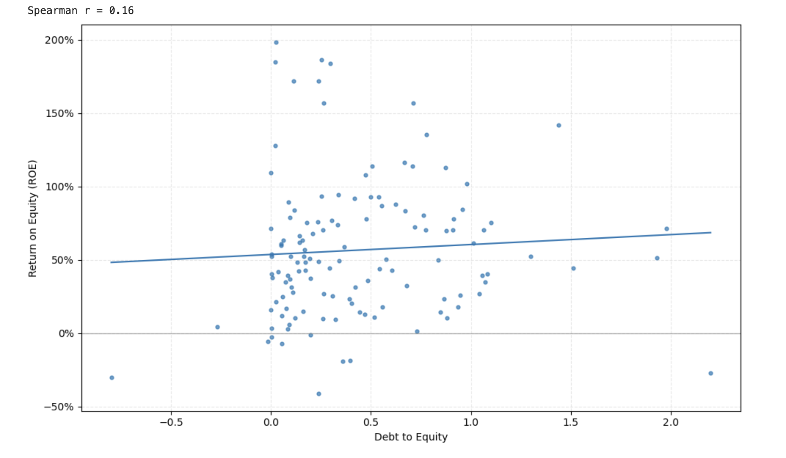

# Business Performance Analysis

This project analyzes business financial health by examining debt ratios and profitability metrics. The goal is to identify high-risk companies, clean and structure raw data for analysis, and generate insights at both the company and state level.

---

## Key Steps

Imported and validated raw business financial data.

Cleaned and normalized data (handling missing values, duplicates, and anomalies).

Calculated Debt-to-Income (DTI) and Debt-to-Equity (D/E) ratios.

Flagged businesses with negative equity (negative D/E) as high-risk.

Aggregated results to generate state-level descriptive statistics.

Visualized relationships between profitability and leverage.

---

## Data Pipeline and Flowchart

The flowchart illustrates the end-to-end data pipeline, moving from raw input to final outputs: import → validate → clean → calculate → flag → aggregate → export.

## Data Pipeline Outputs

`negative_debt_to_equity_businesses.csv` → list of high-risk businesses with negative equity.

`business_level_with_DTI.csv` → cleaned dataset with DTI calculated for each business.

`state_descriptive_stats.csv` → aggregated financial health indicators at the state level.

---

## Visualizations

**Decision Flowchart** 

This flowchart outlines the decision logic behind the upcoming Revenue vs. Profit Margin Matrix: it sets thresholds, treats outliers, and classifies businesses as Stars, Volume Players, Niche Winners, or Strugglers. It’s generated by the included decision_flowchart.py script.

  

**Revenue vs. Profit Margin — Quadrant Matrix**

Companies are classified into four groups (Stars, Volume Players, Niche Winners, Strugglers) based on revenue and profit margin medians.  

  

**Stars — Revenue with Profit Portion**

Highlights top "STAR" companies, showing revenue bars with profit dollars overlaid, including profit margin labels.  

  

**Average Debt‑to‑Income by State:** 

Shows the mean DTI for each state and highlights those with higher leverage.  
  

**High Debt‑to‑Income (>50%):** 

A horizontal bar chart of companies whose DTI exceeds 50%, with an 'X' marking those with negative equity.  
  

**Profit Margin vs. Debt‑to‑Income:** 

Scatter plot of profitability vs DTI, with a trend line and annotations for companies that have negative equity.  
  

**Risk‑colored Debt‑to‑Income vs. Profit Margin:** 

Risk quadrants based on medians and an IQR‑based upper fence; points are colored by risk tier (low, medium, high).  
  

**DuPont Analysis – Profit Margin vs. Asset Turnover:** 

Scatter plot showing how the interaction between profit margin and asset turnover affects return on equity.  
  

**DuPont Analysis – Return on Equity vs. Debt‑to‑Equity:** 

Illustrates how the capital structure (debt‑to‑equity ratio) relates to return on equity, with a trend line.  
  

---
   
## Tools & Skills Demonstrated 

Python (pandas, matplotlib) for data cleaning, transformation, and visualization.

Jupyter Notebook for reproducible analysis.

Financial analysis concepts (leverage ratios, profitability metrics).

Data storytelling — combining ratios and risk flags to interpret business health.

Developed using Python (pandas) in Jupyter Notebook This project is presented as part of my professional portfolio and is not a distributed solution.
